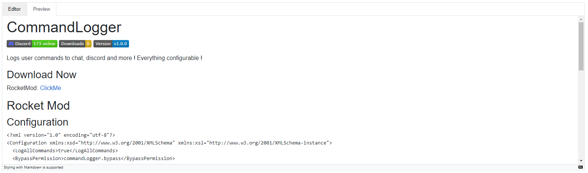

# Blazor MarkdownEditor
Simple good looking markdown editor for blazor



## Installation
```
dotnet add package Feli.Blazor.MarkdownEditor
```

## Usage
Component: MarkdownEditor

Parameters
- Content: The content the editor will work with
- Height: The height of the editor and preview sections
- InfoText: Some help text. Default: `Styling with Markdown is supported`
- Placeholder: Some place holder like: `Write description, features, information, etc...`

Methods:
- GetMarkdown: Gets the markdown text that the user wrote
- GetHTML: Converts the mardown text to html using Markdig

## License

[MIT](https://github.com/01-Feli/Blazor.MarkdownEditor/blob/main/README.md)